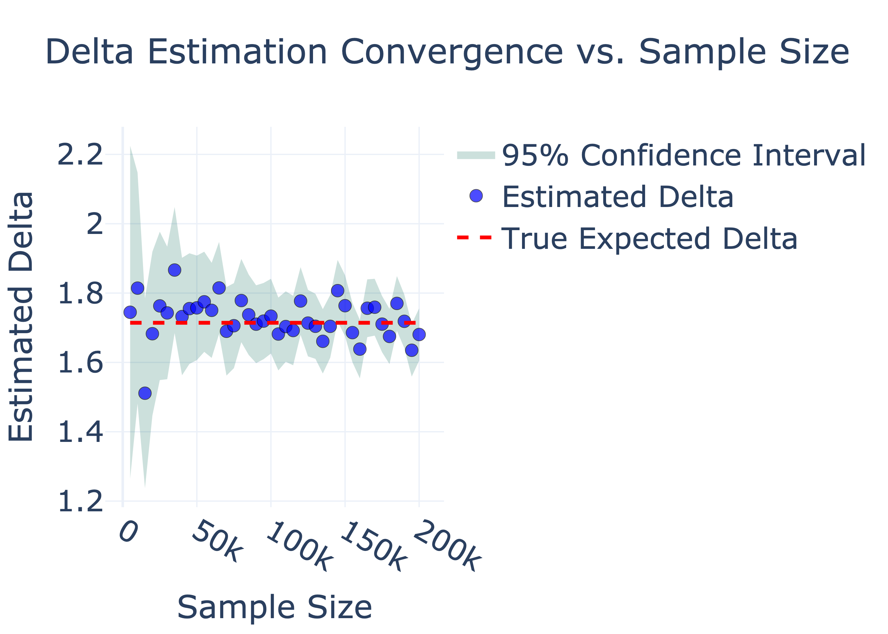
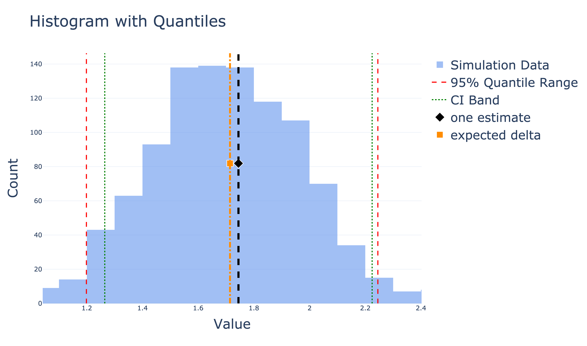
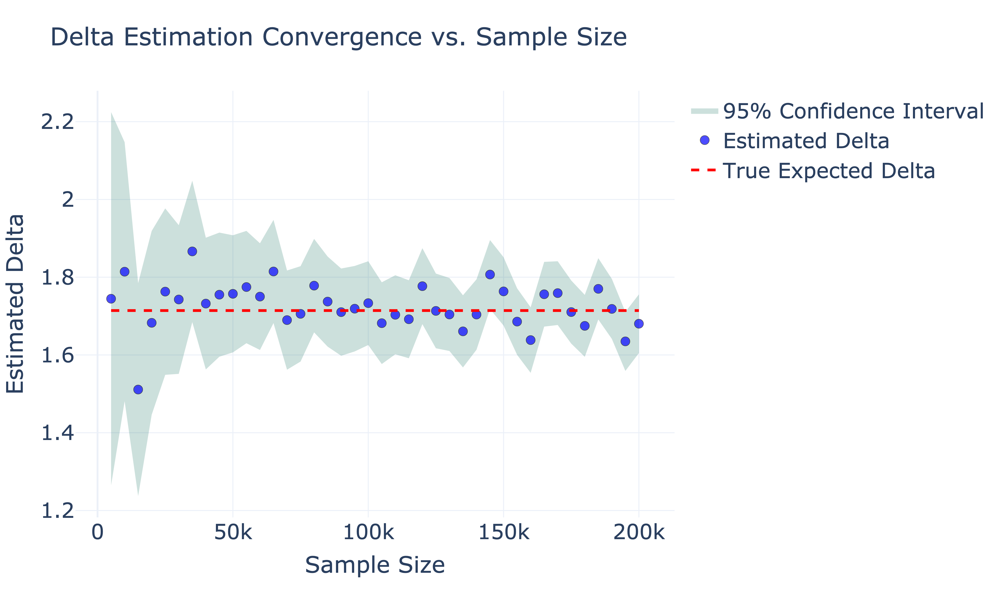

# Run MEA Generic

**Author**: Reza Hosseini

You can use MEA directly on a joined dataframe which has assignment data and metric data in its columns.
This assumes the data is already joined. This implies that the data fits in the memory.

- Install the library using appropriate install command in the corresponding environment e.g.

```bash
pip install abvelocity
```

- Here we show the usage through simulated data.
- The resulting analysis report is here:
    - [HTML](/docs/static//test-results/mea/mea_sim1/mea_test.html)
    - [PDF](/docs/static//test-results/mea/mea_sim1/mea_test.pdf)

- Here are the steps for the simulation:
    - Simulate a heterogeneous population with varying attributes (`ATTRIBUTE_WEIGHTS`): level, country, device
    - For each item in the population, we assign a baseline metrics (`METRIC_ATTRIBUTE_VALUES`)
    - This will also act as a random baseline for each item
    - Two metrics, `metric1` and `metric2` are considered below
    - Then we simulate behavior from two experiments.
    - The assignment weights for various variants is defined by `EXPT_VARIANT_WEIGHTS_MULTI`
    - For Expt 1, we have variants: control, v1, v2
    - For Expt 2, we have variants: control, enabled
    - Then we simulate some univariate effects for each experiment by `EXPT_METRIC_IMPACTS`
    - We deliberately only impose interaction effect on `metric1`
    - Based on univariate impacts for Expt 1:
        - for `metric1` the best variant is `v2 (+5)`
        - for `metric2` the best variant is `v2 (+5)`
    - Based on univariate impacts for Expt 2:
        - for `metric1` the best variant is `control` because enabled is -2
        - for `metric2` the best variant is `enabled` because enabled is +1
    - Note that due to `non_trigger_pct_multi=[5, 5]` argument both experiments almost trigger on all the population
    - Each trigger on random 95% of the population (close to 100%)
    - In the report [HTML](/docs/static//test-results/mea/mea_sim1/mea_test.html),
    we do see that the overlap rate for each experiment by the other is close to 95%.
    - But there is in fact some areas where only one experiment overlaps.
    - If we ignore interactions and assuming both experiments trigger on all population (not exactly true), we would expect to see:
        - for metric1 the best combination is (v2, control) with delta being close to: +5
        - for metric2 the best combination is (v2, enabled), with delta being close to: +6
    - For metric2 due to no interactions we do expect to see a delta close to +5 for (v2, enabled)
    - This is confirmed by the report
    - However, the results should not hold for metric1 due to interaction and we should expect:
        - The best combination is (v1, enabled) with delta close to
            - delta(v1) + delta(enabled) + delta((v1, v2)) =

            ```python
            (-2) + (-2) + 15 = 11
            ```
            A more accurate expected value can be obtained by noticing:
            - The weight of population both Expts trigger: `0.95*0.95 = 0.9025`
            - The weight of population only Expt 1 triggers: `0.95 - 0.9025 = 0.0475`
            - The weight of population only Expt 2 triggers: `0.95 - 0.9025 = 0.0475`
            ```python
            expected_delta = ((-2)*(0.0475) + (-2)*(0.0475) + 11*0.9025) / (0.0475 + 0.0475 + 0.9025) = 9.76
            ```
            - therefore we expect to see a delta close to 11 (smaller because they do not trigger on all population)
        - In the below code block, we have implemented a helper function to calculate the expected delta for this simple
        case where there are only two experiments. The calculation in the function is similar to what we discussed above using
        the example.

```python
import os
from pathlib import Path

import numpy as np
import pandas as pd

from abvelocity.core.get_data.data_container import DataContainer
from abvelocity.core.get_data.join_expt_dfs import join_expt_dfs
from abvelocity.core.get_data.join_expt_with_metric_df import join_expt_with_metric_df
from abvelocity.core.mea.mea import MEA, MEAMetricResult, MEAResult
from abvelocity.core.param.analysis_info import AnalysisInfo
from abvelocity.core.param.constants import TRIGGER_TIME_COL, VARIANT_COL
from abvelocity.core.param.expt_info import ExptInfo, MultiExptInfo
from abvelocity.core.param.launch import Launch
from abvelocity.core.param.metric import Metric, UMetric
from abvelocity.core.param.metric_info import MetricInfo
from abvelocity.core.param.variant import ComparisonPair, Variant, VariantList
from abvelocity.core.sim.sim import Sim

import plotly.graph_objects as go


# Replace `write_path` with the desired path in case you want to store results on disk.
# You could simply display the results without writing, too.
write_path = Path.cwd().joinpath("mea-guides")
write_paths = [str(write_path)]

for path in write_paths:
    os.makedirs(path, exist_ok=True)

# --- Paper figure settings ---
PAPER_FONT_SIZE = 25
PAPER_SCALE = 4
PAPER_WIDTH = 1100
PAPER_HEIGHT = 650
PAPER_FONT = dict(size=PAPER_FONT_SIZE)
PAPER_TICK_FONT = dict(size=PAPER_FONT_SIZE - 2)
PAPER_LEGEND_FONT = dict(size=PAPER_FONT_SIZE - 2)
PAPER_TITLE_FONT = dict(size=PAPER_FONT_SIZE + 2)


ATTRIBUTE_WEIGHTS = {
    "Level": {"Senior": 0.5, "Junior": 0.5},
    "Country": {"Iran": 0.1, "Canada": 0.3, "UK": 0.2, "US": 0.4},
    "Device": {"Smartphone": 0.6, "Tablet": 0.3, "Laptop": 0.1},
}
"""Example Define weights for attributes of the population."""


METRIC_ATTRIBUTE_VALUES = {
    "metric1": {"Level": {"Junior": 5, "Senior": 2}, "Country": {"Iran": +5}},
    "metric2": {"Country": {"USA": 5, "Canada": 2}},
}
"""Example baseline metrics which depends on the attributes (but not experiment assignments)."""

EXPT_VARIANT_WEIGHTS_MULTI = [
    {"control": 0.4, "v1": 0.3, "v2": 0.3},  # Experiment 1
    {"control": 0.4, "enabled": 0.6},  # Experiment 2
]


# Univariate Effects
# For metric1: v1 is bad; enabled is bad. v2 is good.
# For metric2: v2 is good. control is good.
EXPT_METRIC_IMPACTS = [
    {
        "control": {"metric1": 0, "metric2": 0},
        "v1": {"metric1": -2, "metric2": 0},
        "v2": {"metric1": +5, "metric2": +5},
    },  # Experiment 1 impact
    {
        "control": {"metric1": 0, "metric2": 0},
        "enabled": {"metric1": -2, "metric2": +1},
    },  # Experiment 2 impact
]

# Interactions
# Only metric1 has interactions.
# The interactions will push up impact of (v1, enabled)
# and we expect it to change the results due to univar effect for metric1
INTERACTIOIN_METRIC_IMPACTS = {
    ("v1", "enabled"): {"metric1": 15},
    ("v2", "control"): {"metric1": -2},
}


"""Extra noise imposed on the metrics"""
NOISE_SD_DICT = {
    "metric1": 5,
    "metric2": 5
}

SAMPLE_SIZE_DEFAULT = 5000

def get_expected_delta(
        non_trigger_pct_multi: list[float],
        expt_metric_impacts,
        interaction_metric_impacts,
        target_launch,
        metric) -> float:
    """This is a simple helper function to calculate expected delta based on the
    population parameters for the simple case with two experiments.
    Note that this calculation uses the same principals as MEA estimation applied
    to population parameters.
    """


    launch_value = target_launch.value

    # Get trigger rates
    trigger_rates = [(100.0 - x) / 100.0 for x in non_trigger_pct_multi]
    print(f"\n\n\n*** trigger_rates: {trigger_rates}")
    # Trigger rate for Expt 1
    trigger_rate1 = trigger_rates[0]
    # Trigger rate for Expt 2
    trigger_rate2 = trigger_rates[1]
    # Both trigger rate (both of them trigger)
    trigger_rate_both = trigger_rates[0] * trigger_rates[1]
    # Only Expt 1 triggers
    trigger_rate_only1 = trigger_rate1 - trigger_rate_both
    # Only Expt 2 triggers
    trigger_rate_only2 = trigger_rate2 - trigger_rate_both

    # Univariate impact of launch_value in Expt 1
    impact1 = expt_metric_impacts[0][launch_value[0]][metric]

    # Univariate impact of launch_value in Expt 2
    impact2 = expt_metric_impacts[1][launch_value[1]][metric]

    # Extra impact on the common trigger population
    impact_both = (
        impact1 +
        impact2 + interaction_metric_impacts[launch_value][metric]
    )

    # Expected Delta
    # This will be the following weighted sum
    expected_delta = (
        (trigger_rate_only1 * impact1 + trigger_rate_both * (impact_both) + trigger_rate_only2 * impact2) /
        (trigger_rate_only1 + trigger_rate_both + trigger_rate_only2)
    )

    print(f"\n\n\n*** expected_delta: {expected_delta}")
    return expected_delta


def simulate_and_run_mea(
        expt_variant_weights_multi=EXPT_VARIANT_WEIGHTS_MULTI,
        population_seed=42,
        non_trigger_pct_multi=[5, 5],
        expt_assignment_seed_multi=[13, 17],
        noise_seed=None,
        target_launch=Launch(value=("v1", "enabled")),
        control_launch=None,
        sample_size=SAMPLE_SIZE_DEFAULT,
        html_file_name=None,):
    """
    Performing one simulation and applying MEA.

    Args:
    expt_variant_weights_multi: The expt assignments
    population_seed: a seed to generate a heterogenous population
    non_trigger_pct_multi: a list of floats to represent the non-triggered percent for each experiment
    control_launch: This is the "Launch" we compare various combinations with.
        By default, this will be None which maps to `Launch(value=("control", "control"))`.
        This default translates to a world where none of the experiments are ramped.
        For scenario-based analysis we can set this to be a different value.
        For example: `Launch(value=("v1", "enabled"))` is useful to understand the impact of
        Expt 2, if we assumed Expt 1: v1 is ramped to 100 percent.
    sample_size: sample size.
    html_file_name: file name to write the report
    """
    sim = Sim(
        population_size=sample_size, # We only need this many samples in population for this purpose
        attribute_weights=ATTRIBUTE_WEIGHTS,
        metric_attribute_values=METRIC_ATTRIBUTE_VALUES,
        expt_variant_weights_multi=expt_variant_weights_multi,
        population_pcnt_multi=[100, 100],
        non_trigger_pct_multi=non_trigger_pct_multi,
        population_seed=population_seed,
        expt_assignment_seed_multi=expt_assignment_seed_multi,
        expt_metric_impacts=EXPT_METRIC_IMPACTS,
        interaction_metric_impacts=INTERACTIOIN_METRIC_IMPACTS,
        noise_sd_dict=NOISE_SD_DICT,
        noise_seed=noise_seed,
    )

    sim.run()

    assert len(sim.population_df) == sample_size
    assert sim.expt_df.shape[1] == 7
    assert sim.expt_metric_df.shape[1] == 9

    # Let us also create an MEA set up:
    expt1 = ExptInfo(
        test_key=None,
        experiment_id=None,
        segment_id=None,
        start_date=None,
        end_date=None,
        variants=None,
        control_label=None,
    )

    expt2 = ExptInfo(
        test_key=None,
        experiment_id=None,
        segment_id=None,
        start_date=None,
        end_date=None,
        variants=None,
        control_label=None,
    )

    metrics = [Metric(numerator=UMetric(col="metric1")), Metric(numerator=UMetric(col="metric2"))]

    analysis_info = AnalysisInfo(
        MultiExptInfo(expt_info_list=[expt1, expt2], merge_method="cross"),
        metric_info_list=[MetricInfo(metrics=metrics)],
    )


    # Let us run MEA
    pandas_df = sim.expt_metric_df
    if sample_size:
        pandas_df = pandas_df.sample(sample_size)

    mea = MEA(
        dc=DataContainer(pandas_df=pandas_df),
        analysis_info=analysis_info,
        control_launch=control_launch)
    mea.run()

    mea_report = mea.publish(
        write_path=write_path,
        add_timestamp_to_path=False,
        rounding_digits=2,
        html_file_name=html_file_name,
        markdown_file_name=None,
    )

    # You can extract the report in html format:
    html_str = mea_report["html_str"]
    # You can extract the report in markdown format:
    markdown_str = mea_report["markdown_str"]

    # Get the file names for the stored data
    # print(mea_report["file_names"])

    # You can extract the results in a dataframe format as well
    metric1_res = mea.result.metric_result_dict["metric1"].variant_effect_df_pairs
    # print(f"\n\n\nmetric1_res: {metric1_res}")

    if control_launch is None:
        target_launch_label = f"({', '.join(target_launch.value)}) launch"
    else:
        target_launch_label = f"({', '.join(target_launch.value)}) vs ({', '.join(control_launch.value)})"

    if target_launch_label not in metric1_res["comparison_pair"].values:
        raise ValueError(
            "Your population was too small to have any observation of (v1, enabled) in this simulation."
            "You cannot get any conclusions on this combination.")
    res = metric1_res[metric1_res["comparison_pair"] == target_launch_label]
    delta = res["delta"].values[0]
    ci = res["ci"].values[0]
    # print(round(delta, 2))
    # We get: 10.2 which is close to 9.7
    # You can increase the sample size and observe the convergence

    return({"sim": sim, "mea": mea, "mea_report": mea_report, "html_str": html_str, "delta": delta, "ci": ci})


def estimate_launch_impact_via_sim(
        target_launch,
        control_launch=None,
        population_seed=42,
        non_trigger_pct_multi=[5, 5],
        expt_assignment_seed_multi=[13, 17],
        noise_seed=None,
        sample_size=SAMPLE_SIZE_DEFAULT,
    ):
    """
    Performing one simulation for each launch scenario and calculating delta from their diff (only possible with simulations).

    In simulation setting because we can simulate all configurations, we could estimate impacts by simulating various scenarios.
    This is to check if MEA estimates are correct.
    Note that `get_expected_delta` itself relies on logic from MEA (which is mathematically justified),
    and while convergence of MEA results towards expected delta shows consistency, the correctness still relies on math.
    This simulation function however, is another way to valid MEA estimation as it plays out comparing various scenarios directly
    without any reliance on mathematical arguments.

    """

    if control_launch is None:
        control_launch = Launch(value=("control", "control"))

    expt_variant_weights_multi_dict = {
        "baseline": control_launch.value,
        "target": target_launch.value
    }


    expt_metric_df_dict = {}
    impacted_metric1_mean_dict = {}
    impacted_metric1_sum_dict = {}

    for scenario, value in expt_variant_weights_multi_dict.items():
        expt_variant_weights_multi = [{value[0]: 1.0}, {value[1]: 1.0}]
        print(expt_variant_weights_multi)

        sim = Sim(
            population_size=sample_size,
            attribute_weights=ATTRIBUTE_WEIGHTS,
            metric_attribute_values=METRIC_ATTRIBUTE_VALUES,
            expt_variant_weights_multi=expt_variant_weights_multi,
            population_pcnt_multi=[100, 100],
            non_trigger_pct_multi=non_trigger_pct_multi,
            population_seed=sample_size,
            expt_assignment_seed_multi=expt_assignment_seed_multi,
            expt_metric_impacts=EXPT_METRIC_IMPACTS,
            interaction_metric_impacts=INTERACTIOIN_METRIC_IMPACTS,
            noise_sd_dict=NOISE_SD_DICT,
            noise_seed=noise_seed,
        )

        sim.run()

        pandas_df = sim.expt_metric_df
        if sample_size:
            pandas_df = pandas_df.sample(sample_size)

        expt_metric_df_dict[scenario] = pandas_df

        # We are interested in the delta on the impacted units where at least one experiment triggers
        impacted_pandas_df = pandas_df.loc[pandas_df["variant"] != ("nan", "nan")]
        print(f"\n*** len pandas_df: {len(pandas_df)}")
        print(f"\n*** len impacted_pandas_df: {len(impacted_pandas_df)}")

        impacted_metric1_mean_dict[scenario] = impacted_pandas_df["metric1"].mean()
        impacted_metric1_sum_dict[scenario] = impacted_pandas_df["metric1"].sum()

    delta = impacted_metric1_mean_dict["target"] - impacted_metric1_mean_dict["baseline"]
    delta_sum = impacted_metric1_sum_dict["target"] - impacted_metric1_sum_dict["baseline"]

    return {"delta": delta, "delta_sum": delta_sum}
```

### Simple MEA run

- Simple MEA run here:
- MEA report will include all launch impacts compared with baseline where all experiemnts are on control (no change)


```python
print("\n\n\n^^^: simple MEA (combinations impact)")
target_launch_value = ("v1", "enabled")
target_launch = Launch(value=target_launch_value)
non_trigger_pct_multi = [5, 5]

# Note this is one simulation of data
# Therefore all seeds could be set
res = simulate_and_run_mea(
    population_seed=42,
    non_trigger_pct_multi=[5, 5],
    expt_assignment_seed_multi=[13, 17],
    noise_seed=1317,
    target_launch=target_launch,
    sample_size=SAMPLE_SIZE_DEFAULT,
    html_file_name="mea-report.html")


html_str = res["html_str"]
```

- [HTML](/docs/static//test-results/mea/mea-guides/mea-report.html)
- [PDF](/docs/static//test-results/mea/mea-guides/mea-report.pdf)


- You can display the html also in a Python notebook:

```python
html_str = res["html_str"]
# from IPython.display import display, HTML
# display(HTML(html_str))
```

### Scenario based example

- Next let's run a scenario based analysis to see the impact
- In this scenario we, assess the imapct of Expt2: 'enabled' if Expt1: 'v1' is already launched.
- In this case the baseline will be `Launch(value=("v1", "control"))`

```python
print("\n\n\n^^^: scenario based")
print(f"\n\n\ntarget launch: {target_launch}")

# Note that again this is only one simulation
# Also note that only argument here which is different is `control_launch=Launch(value=("v1", "control"))`
res = simulate_and_run_mea(
    population_seed=42,
    non_trigger_pct_multi=non_trigger_pct_multi,
    expt_assignment_seed_multi=[13, 17],
    target_launch=target_launch,
    control_launch=Launch(value=("v1", "control")),
    sample_size=SAMPLE_SIZE_DEFAULT,
    html_file_name="mea-report-scenario.html")

delta = res["delta"]
print(f"delta: {delta}")
html_str = res["html_str"]
# display(HTML(html_str))
```

- [HTML for scenario based](/docs/static//test-results/mea/mea-guides/mea-report-scenario.html)
- [PDF for scenario based](/docs/static//test-results/mea/mea-guides/mea-report-scenario.pdf)

#### Low overlap example

- Next we demonstrate the impact of lower overlap of the two experiments
- With our simulations, we can achieve a low overlap by setting

```python
non_trigger_pct_multi = [90, 90]
```

- Since the experiments are orthogonal, this will imply that:
    - `0.1 * 0.1 = 0.01` impacted by both
    - (0.1 - 0.01) = 0.09 impacted by Expt 1 only
    - (0.1 - 0.01) = 0.09 impacted by Expt 2 only
    - Therefore the expected delta would be:
```python
expected_delta = (0.09 * -2 + 0.01 * (-2 - 2 + 15) + 0.09 * -2) / (0.09 + 0.01 + 0.09)
```
    - But we could simply also use our helper function we defined before:

```python
expected_delta = get_expected_delta(
    non_trigger_pct_multi=non_trigger_pct_multi,
    expt_metric_impacts=EXPT_METRIC_IMPACTS,
    interaction_metric_impacts=INTERACTIOIN_METRIC_IMPACTS,
    target_launch=target_launch,
    metric="metric1")
```
    - These numbers will match and expected delta will be close to -1.3


Now let us do MEA for this case and confirm the obtained estimate is close to the population parameter.

```python
print(f"\n\n\n^^^: MEA low overlap")
non_trigger_pct_multi = [90, 90]
res = simulate_and_run_mea(
    population_seed=42,
    non_trigger_pct_multi=non_trigger_pct_multi,
    expt_assignment_seed_multi=[13, 17],
    noise_seed=1317,
    target_launch=target_launch,
    control_launch=None,
    sample_size=20000,  # Larger because of small overlap
    html_file_name="mea-report-low-overlap.html")

delta = res["delta"]
print(f"delta: {delta}")
html_str = res["html_str"]
# display(HTML(html_str))
```

- [HTML for low overlap](/docs/static//test-results/mea/mea-guides/mea-report-low-overlap.html)
- [PDF for low overlap](/docs/static//test-results/mea/mea-guides/mea-report-low-overlap.pdf)


### Simulation study
Next we perform a simulation to check if the MEA estimation method is unbiased and has the
correct coverage for the computed confidence intervals.

Here are the settings we use for this simulation.

```python
non_trigger_pct_multi = [50, 60]
target_launch_value = ("v1", "enabled")
target_launch = Launch(value=target_launch_value)
target_launch_label = f"({', '.join(target_launch_value)}) launch"
```


First we compute the population expected delta.
```python
expected_delta = get_expected_delta(
    non_trigger_pct_multi=non_trigger_pct_multi,
    expt_metric_impacts=EXPT_METRIC_IMPACTS,
    interaction_metric_impacts=INTERACTIOIN_METRIC_IMPACTS,
    target_launch=target_launch,
    metric="metric1")
print(f"expected delta: {expected_delta}")
```


#### Run simulation to check correctness of population parameter computation

Note that we used the mathematical argument from MEA to compute the expected delta.
To confirm this computation of the expected delta is correct, we use simulations.
With simulations we can generate the target scenario and compare it with another simulation for
the control (baseline) scenario. Note that this is only possible in simulation settings.
If we use large samples in the simulations, we will converge to the true parameter if the true parameter
is computed correctly.


```python
# Note that since we are simulating multiple instances of the experiments, we let teh seeds change
# The seed for population is fixed here as we assume triggetings numbers are the same
# This could also be set to change however, it will only result in some more variance
# But for large samples the impact will be small.
sample_sizes = np.arange(500, 50000, 500)
res_list_from_sim_comparison = [
    estimate_launch_impact_via_sim(
        target_launch=target_launch,
        control_launch=None,
        population_seed=42,
        non_trigger_pct_multi=non_trigger_pct_multi,
        expt_assignment_seed_multi=[j + 13, j + 17],
        noise_seed=1317 + j,
        sample_size=sample_sizes[j],
        ) for j in range(len(sample_sizes))
]

estimated_deltas = [res["delta"] for res in res_list_from_sim_comparison]
print(estimated_deltas)

# --- 1. Format the Launch Label ---

# --- 2. Create the Convergence Line Plot ---
fig_conv = go.Figure()

# Line plot of estimates across sample sizes - UPDATED with markers for visibility
fig_conv.add_trace(go.Scatter(
    x=sample_sizes,
    y=estimated_deltas,
    mode='lines+markers',
    line=dict(color='rgba(0, 115, 175, 0.8)', width=2),
    marker=dict(size=10, line=dict(width=1, color='black')),
    name='Estimated Delta'
))

# Reference line for the ground truth
fig_conv.add_trace(go.Scatter(
    x=sample_sizes,
    y=[expected_delta] * len(sample_sizes),
    mode='lines',
    line=dict(color='firebrick', width=3, dash='dash'),
    name=f'Expected Delta: {expected_delta:.4f}'
))

fig_conv.update_layout(
    title=dict(text=f"Convergence Analysis for {target_launch_label}", font=PAPER_TITLE_FONT),
    xaxis_title=dict(text="Sample Size (N)", font=PAPER_FONT),
    yaxis_title=dict(text="Estimated Delta", font=PAPER_FONT),
    xaxis=dict(tickfont=PAPER_TICK_FONT),
    yaxis=dict(tickfont=PAPER_TICK_FONT),
    template="plotly_white",
    hovermode="x unified",
    legend=dict(yanchor="top", y=0.99, xanchor="left", x=0.01, font=PAPER_LEGEND_FONT)
)

# Exporting high-quality PNGs
for path in write_paths:
    fig_conv.write_image(f"{path}/sim_based_expected_delta_validation.png", scale=4)

fig_conv.show()


# --- 3. Export with the specific filename ---
for path in write_paths:
    fig_conv.write_image(f"{path}/sim_based_expected_delta_validation.png", scale=PAPER_SCALE, width=PAPER_WIDTH, height=PAPER_HEIGHT)
    fig_conv.write_html(f"{path}/sim_based_expected_delta_validation.html")

print(f"Line-based convergence plot saved as 'sim_based_delta_convergence' in both directories.")

```




#### Run simulation for CI

To that end we simulate the experiment data `n = 1000` times by randimizing
user attributes and user assignments to experiment arms.
Then we compare the histogram of estimated deltas and true delta. We also show
one random estimate and its confidence interval.
First we define a function to simulate the flow given a fixed input for the experiment settings
but randomizing the population seed and experiment assignments.


```python
def sim_flow(
        non_trigger_pct_multi,
        population_seed,
        expt_assignment_seed_multi,
        noise_seed,
        sample_size=SAMPLE_SIZE_DEFAULT,
        ):
    res = simulate_and_run_mea(
        population_seed=population_seed,
        non_trigger_pct_multi=non_trigger_pct_multi,
        expt_assignment_seed_multi=expt_assignment_seed_multi,
        noise_seed=noise_seed,
        target_launch=target_launch,
        control_launch=None,
        sample_size=sample_size)

    delta = res["delta"]
    print(f"delta: {delta}")
    html_str = res["html_str"]
    return {"delta": delta, "ci": res["ci"]}
```

* CI coverage

Then we run this 1000 times and compare the true delta parameter (expected delta)
with histogram of 1000 estimated parameters.


```python
from abvelocity.core.utils.hist_with_quantiles import hist_with_quantiles


# --- 1. Simulation Logic ---

#####
sim_num = 1000
# sample size is fixed below
res_list = [
    sim_flow(
        non_trigger_pct_multi=non_trigger_pct_multi,
        population_seed=(j + 1317),
        expt_assignment_seed_multi=[j + 13, j + 17],
        noise_seed=1317 + j,
        ) for j in range(sim_num)
]

# --- 2. Aggregate & Single Instance Stats ---
delta_array = [res["delta"] for res in res_list]
sim_delta_quantile_range = np.quantile(delta_array, 0.975) - np.quantile(delta_array, 0.025)

ci_array = [res["ci"] for res in res_list]
ci_length_average = np.mean([(ci[1] - ci[0]) for ci in ci_array])
ci_coverage = np.mean([(ci[0] <= expected_delta <= ci[1]) for ci in ci_array])
precision_ratio = ci_length_average / sim_delta_quantile_range

print("\n***: Simulation Stats")
print(f"Expected Delta: {expected_delta:.4f}")
print(f"Simulated Delta 95% Quantile Range: {sim_delta_quantile_range:.4f}")
print(f"Average CI Length: {ci_length_average:.4f}")
print(f"CI Coverage: {ci_coverage:.2%}")
print(f"Precision Ratio: {precision_ratio:.4f}")

one_sim = sim_flow(
    non_trigger_pct_multi=non_trigger_pct_multi,
    population_seed=1317,
    expt_assignment_seed_multi=[13, 17],
    noise_seed=1317,)
one_delta, one_ci = one_sim["delta"], one_sim["ci"]

# --- 3. Table and LaTeX Generation ---
stats_data = {
    "Metric": [
        "Expected Delta (True)",
        "Example Delta (Single Run)",
        "Example CI Lower",
        "Example CI Upper",
        "Average CI Length (All Runs)",
        "Simulated Delta 95% Quantile Range",
        "CI Coverage Probability",
        "Precision Ratio"
    ],
    "Value": [expected_delta, one_delta, one_ci[0], one_ci[1],
              ci_length_average, sim_delta_quantile_range, ci_coverage, precision_ratio]
}

df_stats = pd.DataFrame(stats_data)
print("\n***: Simulation Diagnostic Summary:\n")
print(df_stats)

latex_table = df_stats.to_latex(
    index=False,
    caption="Simulation Diagnostics: Point Estimates and CI Coverage Performance",
    label="tab:mea_sim_results",
    float_format="%.4f",
    column_format="lc",
    escape=True
)

# --- 4. Write Latex Table ---
for path in write_paths[2:]:
    with open(f"{path}/sim_results_table.tex", "w") as f:
        f.write(latex_table)

# --- 5. Write Figures ---
for path in write_paths:
    fig = hist_with_quantiles(
        x=delta_array,
        vertical_lines_dict={"one estimate": one_delta, "expected delta": expected_delta},
        bands=list(one_ci),
        font_size=PAPER_FONT_SIZE)

    fig.write_image(f"{path}/several_mea_delta_estimates_and_mea_ci.png", scale=PAPER_SCALE, width=PAPER_WIDTH, height=PAPER_HEIGHT)
    fig.write_html(f"{path}/several_mea_delta_estimates_and_mea_ci.html")

fig.show()
```





#### Simulation study: Check convergence via sample size increase

```python
# Check convergence
# 1. Run the simulation across increasing sample sizes
sample_sizes = np.arange(5000, 200001, 5000)
res_list_increase_sample_size = [
    sim_flow(
        non_trigger_pct_multi=non_trigger_pct_multi,
        population_seed=(j + 1317),
        expt_assignment_seed_multi=[j + 13, j + 17],
        noise_seed=1317 + j,
        sample_size=sample_sizes[j],
        ) for j in range(len(sample_sizes))
]

# 2. Extract deltas and CIs for plotting
estimated_deltas = [res["delta"] for res in res_list_increase_sample_size]
cis = [res["ci"] for res in res_list_increase_sample_size]
lower_bounds = [ci[0] for ci in cis]
upper_bounds = [ci[1] for ci in cis]


# 3. Create the Convergence Plot
fig_conv = go.Figure()

# Add the CI Shading (Optional but highly recommended for convergence)
fig_conv.add_trace(go.Scatter(
    x=np.concatenate([sample_sizes, sample_sizes[::-1]]),
    y=np.concatenate([upper_bounds, lower_bounds[::-1]]),
    fill='toself',
    fillcolor='rgba(0,100,80,0.2)',
    line=dict(color='rgba(255,255,255,0)'),
    hoverinfo="skip",
    showlegend=True,
    name='95% Confidence Interval'
))

# Add the estimated deltas - UPDATED: Increased marker size/opacity for visibility
fig_conv.add_trace(go.Scatter(
    x=sample_sizes,
    y=estimated_deltas,
    mode='markers',
    marker=dict(size=10, color='blue', opacity=0.7, line=dict(width=0.5, color='black')),
    name='Estimated Delta'
))

# Add the true expected delta line - UPDATED: Increased width
fig_conv.add_trace(go.Scatter(
    x=sample_sizes,
    y=[expected_delta] * len(sample_sizes),
    mode='lines',
    line=dict(color='red', dash='dash', width=3),
    name='True Expected Delta'
))

fig_conv.update_layout(
    title=dict(text="Delta Estimation Convergence vs. Sample Size", font=PAPER_TITLE_FONT),
    xaxis_title=dict(text="Sample Size", font=PAPER_FONT),
    yaxis_title=dict(text="Estimated Delta", font=PAPER_FONT),
    xaxis=dict(tickfont=PAPER_TICK_FONT),
    yaxis=dict(tickfont=PAPER_TICK_FONT),
    template="plotly_white",
    hovermode="x unified",
    legend=dict(font=PAPER_LEGEND_FONT)
)

# Exporting high-quality PNGs
for path in write_paths:
    fig_conv.write_image(f"{path}/sim_based_expected_delta_validation.png", scale=4)

fig_conv.show()


# Save to your paths
for path in write_paths:
    fig_conv.write_image(f"{path}/mea_delta_ci_convergence_sample_size_increase.png", scale=PAPER_SCALE, width=PAPER_WIDTH, height=PAPER_HEIGHT)
    fig_conv.write_html(f"{path}/mea_delta_ci_convergence_sample_size_increase.html")

```

